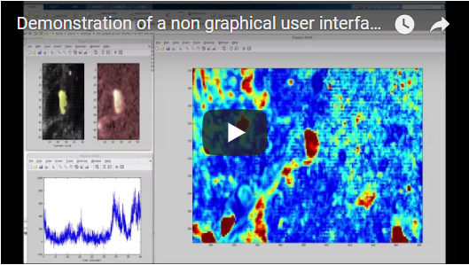

# Drawing ROIs without GUI
Drawing ROIs with a non-graphical user interface in Matlab

Drawing ROIs is a repetitive task when analyzing calcium imaging data. Despite automatization attempts (http://neurofinder.codeneuro.org/), most of the time drawing the ROIs manually is still the best solution.

In order to make this task as easy and intuitive as possible, I used a non-graphical user interface that relies on the user's knowledge of which keys and which mouse buttons to press (inspired by the Google Maps interface). I described the idea of this non-graphical user interface on [my blog](https://ptrrupprecht.wordpress.com/2015/06/24/a-simple-non-graphical-user-interface-in-matlab-keyboard-callback-functions/). The callback functions are defined in [this subscript](https://github.com/PTRRupprecht/Drawing-ROIs-without-GUI/blob/master/non-GUI%20ROI%20analysis/switchImage.m).

The main script ('Simple_main_Analysis.m') loads a 3D stack into the RAM and performs a couple of pre-processing steps before opening the non-graphical user interface (which is basically a simple image opened in Matlab, glued to a couple of key-stroke- and mouse-gesture-specific callback functions). The video linked above gives an overview over the keys (=shortcuts) and how to use them on a real calcium imaging dataset.

Variations of this script have been used to extract activity of neurons from calcium imaging data in the following papers:  [paper 1]( http://dx.doi.org/10.1016/j.cub.2017.11.007), [paper 2](https://www.osapublishing.org/boe/abstract.cfm?uri=boe-7-5-1656).
